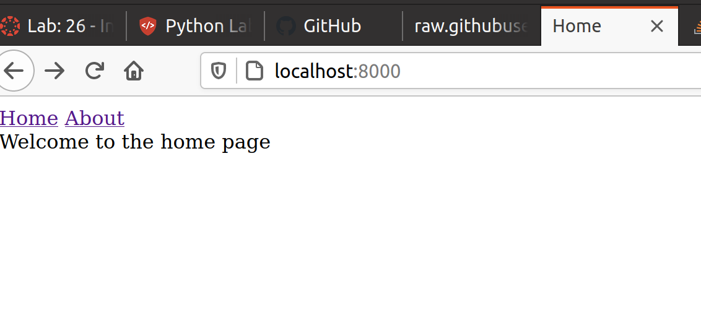

# Django snacks

## Django Snacks

Lab26 - Django intro 

*Author: Lee-Roy King*

----

## Description
This is a minimal Django server to practice wiring it up and templating some html
---

### Getting Started
Clone this repository to your local machine.

```
$ git clone git@github.com:leeroywking/django_snacks.git
```

### To run the program from VS Code:
Enter the project folder and run 
`python manage.py runserver`
---

### Visuals

---

### Change Log
1.0.0 - Implemented basic features

